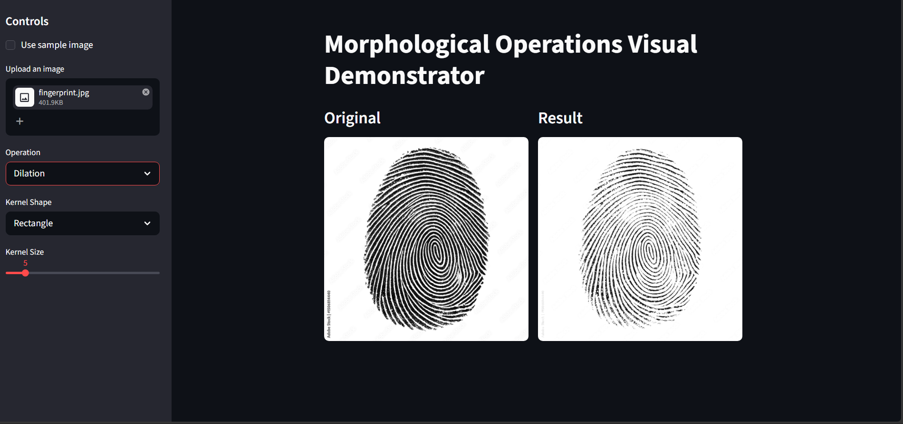
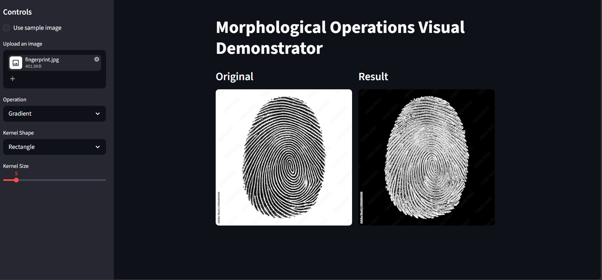

# Morphological Operations Visual Demonstrator

A computer vision web app built with Python, OpenCV, and Streamlit that lets you upload an image and visually see the effect of different morphological operations in real time.

---

## What It Does

Upload any grayscale image (fingerprint, text, shapes), select an operation and kernel configuration from the sidebar, and instantly see the original vs. result side by side.

---

## Operations Supported

| Operation | Description |
|---|---|
| Erosion | Shrinks bright regions, removes small noise |
| Dilation | Expands bright regions, fills small gaps |
| Opening | Erosion followed by Dilation — removes noise while preserving shape |
| Closing | Dilation followed by Erosion — fills holes while preserving shape |
| Gradient | Dilation minus Erosion — highlights object edges/outlines |
| Top Hat | Original minus Opening — highlights small bright details |
| Black Hat | Closing minus Original — highlights small dark details |

---

## Tech Stack

- Python 3.10
- OpenCV (`cv2`)
- Streamlit
- NumPy
- Pillow

---

## Project Structure

```
Morphological-Operations-Visual-Demonstrator/
│
├── app.py              # Main Streamlit UI
├── operations.py       # All morphological operation logic
├── utils.py            # Image loading, conversion, test image generation
├── assets/
│   └── fingerprint.png # Sample test image
└── requirements.txt
```

---

## How to Run

**1. Clone the repository**
```bash
git clone https://github.com/yourusername/Morphological-Operations-Visual-Demonstrator.git
cd Morphological-Operations-Visual-Demonstrator
```

**2. Create and activate virtual environment**
```bash
python -m venv venv --without-pip
venv\Scripts\activate        # Windows
source venv/bin/activate     # Mac/Linux
```

**3. Install dependencies**
```bash
python -m ensurepip
pip install -r requirements.txt
```

**4. Run the app**
```bash
streamlit run app.py
```

Opens at `http://localhost:8501`

---

## Usage

1. Upload an image using the sidebar file uploader (JPG/PNG)
2. Or check **"Use sample image"** to use the built-in test image
3. Select an operation from the dropdown
4. Choose kernel shape — Rectangle, Ellipse, or Cross
5. Adjust kernel size using the slider
6. View original vs. result side by side

---

## Requirements

```
opencv-python
streamlit
numpy
Pillow
```

---

## Sample Output

Upload a fingerprint image and try:


### Dilation

### Gradient

